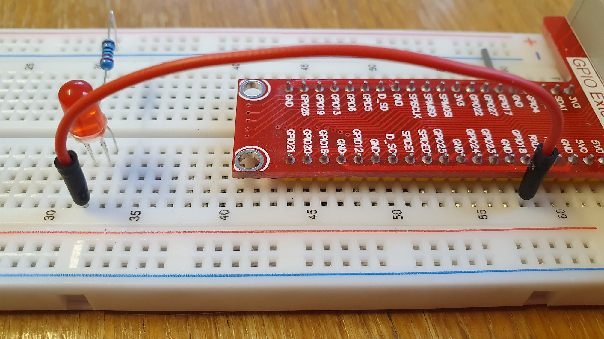
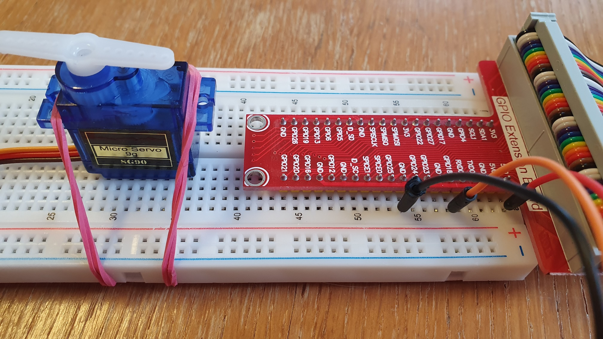

# Hardware generated Pulse Width Modulation

## General

```text
     I--------------------I           I----- 3.3 Volt (1)
     I                    I           I
-----I                    I-----------I      0.0 Volt (0)

     I------- pulse ------I
     I------------- period -----------I
```

## Terminology

**Pulse Width** (PW): Pin/line is on (high, 3.3V) for a specified time.

**Period** (T): Sum of pulse width + space width.

**Duty Cycle** (wikipedia): A duty cycle or power cycle is the fraction of one period in which a signal or system is active. Duty cycle is commonly expressed as a percentage or a ratio. A period is the time it takes for a  signal to complete an on-and-off cycle. As a formula, a duty cycle (%) may be expressed as:
```text
D = Duty Cycle, PW = Pulse Width, T = Period
D = PW / T * 100
```

**Frequency** (wikipedia): Frequency most often measured in hertz (symbol: Hz), is the number of occurrences of a repeating event per unit of time.
```text
f = Frequency, 1 = 1 second, T = Period
f = 1 / T
```

**Frequency versus Period:**
```text
Frequency  Period
1 Hz       1 s  (second)
1 kHz      1 ms (millisecond)
1 MHz      1 μs (microsecond)
1 GHz      1 ns (nanosecond)
```

## Raspberry Pi

The Raspberry Pi has the option to provide one or two hardware generated PWM channels with a granularity of 1 nanosecond (ns). This must be configured in /boot/config.txt. See /boot/overlays/README for configuration details.

**One PWM channel on default pin GPIO18:**
```text
dtoverlay=pwm
```

**Two PWM channels on default pins GPIO18 and GPIO19:**
```text
dtoverlay=pwm-2chan
```

**Raspberry Pi 5 with two PWM channels configured:**
```text
$ pinctrl
...
17: no    pd | -- // PIN11/GPIO17 = none
18: a3    pd | lo // PIN12/GPIO18 = PWM0_CHAN2
19: a3    pd | lo // PIN35/GPIO19 = PWM0_CHAN3
20: no    pd | -- // PIN38/GPIO20 = none
...
```

**Raspberry Pi 4 with two PWM channels configured:**
```text
$ pinctrl
...
17: ip    pd | lo // GPIO17 = input
18: a5    pd | lo // GPIO18 = PWM0_0
19: a5    pd | lo // GPIO19 = PWM0_1
20: ip    pd | lo // GPIO20 = input
...
```

**Chip and channel naming on Raspberry Pi 4:**
* chip = pwmchip0
* channels = 0, 1
* default pins = GPIO18, GPIO19

**Chip and channel naming on Raspberry Pi 5:**
* chip = pwmchip2
* channels = 2, 3
* default pins = GPIO18, GPIO19

## Linux

Linux provides a simple sysfs interface to use the PWM channels. This can be done interactive or via program. The following shell script (see blink.sh in examples) shows the general usage of the sysfs PWM interface.

```shell
#!/bin/sh
# Raspberry Pi 4: chip=pwmchip0, channel=0 on pin=GPIO18, channel=1 on pin=GPIO19
# Raspberry Pi 5: chip=pwmchip2, channel=2 on pin=GPIO18, channel=3 on pin=GPIO19
# Linux kernel documentation: www.kernel.org/doc/Documentation/pwm.txt

set -o verbose

# set chip name and channel number
CHANNEL=2
CHIP=pwmchip2
PWM=pwm$CHANNEL

# export channel
echo $CHANNEL > /sys/class/pwm/$CHIP/export
sleep 1

# let something blink (e.g. LED on pin GPIO18)
DutyCycleKeptByLinux=$(cat /sys/class/pwm/$CHIP/$PWM/duty_cycle)
if [ $DutyCycleKeptByLinux != "0" ]; then
  echo 0 > /sys/class/pwm/$CHIP/$PWM/duty_cycle
fi
echo 1000000000 > /sys/class/pwm/$CHIP/$PWM/period
echo 500000000 > /sys/class/pwm/$CHIP/$PWM/duty_cycle
echo 1 > /sys/class/pwm/$CHIP/$PWM/enable
sleep 10
echo 0 > /sys/class/pwm/$CHIP/$PWM/enable

# unexport channel
echo $CHANNEL > /sys/class/pwm/$CHIP/unexport
```

A full description of the sysfs interface can be found in the Linux documentation (e.g. https://www.kernel.org/doc/Documentation/pwm.txt). Excerpt:

```text
Using PWMs with the sysfs interface
-----------------------------------

If CONFIG_SYSFS is enabled in your kernel configuration a simple sysfs
interface is provided to use the PWMs from userspace. It is exposed at
/sys/class/pwm/. Each probed PWM controller/chip will be exported as
pwmchipN, where N is the base of the PWM chip. Inside the directory you
will find:

  npwm
    The number of PWM channels this chip supports (read-only).

  export
    Exports a PWM channel for use with sysfs (write-only).

  unexport
   Unexports a PWM channel from sysfs (write-only).

The PWM channels are numbered using a per-chip index from 0 to npwm-1.

When a PWM channel is exported a pwmX directory will be created in the
pwmchipN directory it is associated with, where X is the number of the
channel that was exported. The following properties will then be available:

  period
    The total period of the PWM signal (read/write).
    Value is in nanoseconds and is the sum of the active and inactive
    time of the PWM.

  duty_cycle
    The active time of the PWM signal (read/write).
    Value is in nanoseconds and must be less than the period.

  polarity
    Changes the polarity of the PWM signal (read/write).
    Writes to this property only work if the PWM chip supports changing
    the polarity. The polarity can only be changed if the PWM is not
    enabled. Value is the string "normal" or "inversed".

  enable
    Enable/disable the PWM signal (read/write).
    - 0 - disabled
    - 1 - enabled
```

**Remarks:**
* Linux uses the confusing term duty_cycle instead of pulse or pulse width.
* After system boot pulse and period are set to their default value 0.
* Linux keeps the values for pulse and period after unexport.
* Linux always verifies that pulse (duty_cycle) is less than period!
* Linux needs some time to give us the permission to use an exported PWM channel.

**Implications:**
* Pulse can not be equal or greater than period.
* Period can not be less or equal than pulse.
* After export we must wait for channel permission. 

**Robust initialization strategy:**
* get pulse value kept by Linux
* if pulse > 0: set pulse to 0
* set period to planned value
* set pulse to planned value
* InitializeChannel() handles this

## Package pwm

This library tries to stay as close as possible to the Linux sysfs PWM interface. This package provides the following:

**Wrapper functions:**
* Export(chip, channel string) (ChannelHandle, error)
* Unexport(ch *ChannelHandle) error
* SetPulse(ch *ChannelHandle, pulse time.Duration) error
* SetPeriod(ch *ChannelHandle, period time.Duration) error
* Enable(ch *ChannelHandle) error
* Disable(ch *ChannelHandle) error

**Convinience function:**
* Initialize(chip, channel string, pulse, period, waitForPermission time.Duration) (ChannelHandle, error)

**Helper functions:**
* FrequencyToPeriod(frequency float64) time.Duration
* DutyCycleToPulse(ch *ChannelHandle, dutyCycle float64) time.Duration

**Special purposes:**
* GetPulseFromOS(ch *ChannelHandle) (time.Duration, error)
* GetPeriodFromOS(ch *ChannelHandle) (time.Duration, error)
* GetIsEnabledFromOS(ch *ChannelHandle) (bool, error)

**Channel handle:**

The channel handle keeps track of the current channel settings. After setting the values for pulse and period, this
reflects to the current values kept by Linux. Remember: Linux keeps the values for pulse and period after an unexport
operation.

```go
type ChannelHandle struct {
	Chip      string
	Channel   string
	Pulse     time.Duration
	Period    time.Duration
	IsEnabled bool
}
```
## Basic usage

The following examples shows the basic package usage.

**Example 1: 'Blinking LED'**



```go
// Blinking LED with hardware generated Pulse Width Modulation (PWM).
// Raspberry Pi 4: chip=pwmchip0, channel=0 on pin=GPIO18, channel=1 on pin=GPIO19
// Raspberry Pi 5: chip=pwmchip2, channel=2 on pin=GPIO18, channel=3 on pin=GPIO19

package main

import (
	"fmt"
	"log"
	"time"

	"github.com/Klaus-Tockloth/pwm"
)

func main() {
	chip := "pwmchip2"
	channel := "2"
	pulse := time.Duration(500 * time.Millisecond)
	period := time.Duration(1000 * time.Millisecond)
	waitForPermission := time.Duration(500 * time.Millisecond)

	ledPwmHandle, err := pwm.Initialize(chip, channel, pulse, period, waitForPermission)
	if err != nil {
		log.Printf("error [%v] at pwm.Initialze()", err)
		return
	}

	defer func() {
		err = pwm.Unexport(&ledPwmHandle)
		if err != nil {
			log.Printf("error [%v] at pwm.Unexport()", err)
		}
	}()

	err = pwm.Enable(&ledPwmHandle)
	if err != nil {
		log.Printf("error [%v] at pwm.Enable()", err)
		return
	}

	fmt.Printf("LED should blink ...\n")
	time.Sleep(10 * time.Second)

	// adjust period width for given frequency in hz
	err = pwm.SetPeriod(&ledPwmHandle, pwm.FrequencyToPeriod(0.5))
	if err != nil {
		log.Printf("error [%v] at pwm.SetPeriod()", err)
		return
	}

	fmt.Printf("LED should blink slower ...\n")
	time.Sleep(10 * time.Second)

	// adjust pulse width for given duty cyle in %
	err = pwm.SetPulse(&ledPwmHandle, pwm.DutyCycleToPulse(&ledPwmHandle, 75.0))
	if err != nil {
		log.Printf("error [%v] at pwm.SetPulse()", err)
		return
	}

	fmt.Printf("LED should blink longer ...\n")
	time.Sleep(10 * time.Second)

	err = pwm.Disable(&ledPwmHandle)
	if err != nil {
		log.Printf("error [%v] at pwm.Disable()", err)
		return
	}

	// program exit: unexport is done by defer function
	fmt.Printf("Done\n")
}
```

**Example 2: 'Servo Control'**



```go
// Servo control with hardware generated Pulse Width Modulation (PWM).
// Raspberry Pi 4: chip=pwmchip0, channel=0 on pin=GPIO18, channel=1 on pin=GPIO19
// Raspberry Pi 5: chip=pwmchip2, channel=2 on pin=GPIO18, channel=3 on pin=GPIO19
// Servo parameters:
// - period           =   20000 μs
// - min angle        =     500 μs
// - neutral position =    1500 μs
// - max angle        =    2500 μs

package main

import (
	"fmt"
	"log"
	"time"

	"github.com/Klaus-Tockloth/pwm"
)

func main() {
	chip := "pwmchip2"
	channel := "2"
	pulse := time.Duration(1500 * time.Microsecond) // neutral position
	period := time.Duration(20000 * time.Microsecond)
	waitForPermission := time.Duration(500 * time.Millisecond)

	servoPwmHandle, err := pwm.Initialize(chip, channel, pulse, period, waitForPermission)
	if err != nil {
		log.Printf("error [%v] at pwm.Initialze()", err)
		return
	}

	defer func() {
		err = pwm.Unexport(&servoPwmHandle)
		if err != nil {
			log.Printf("error [%v] at pwm.Unexport()", err)
		}
	}()

	fmt.Printf("servo neutral position ...\n")
	err = pwm.Enable(&servoPwmHandle)
	if err != nil {
		log.Printf("error [%v] at pwm.Enable()", err)
		return
	}
	time.Sleep(2 * time.Second)

	fmt.Printf("servo min position ...\n")
	err = pwm.SetPulse(&servoPwmHandle, time.Duration(500*time.Microsecond))
	if err != nil {
		log.Printf("error [%v] at pwm.SetPulse()", err)
		return
	}
	time.Sleep(2 * time.Second)

	fmt.Printf("servo max position ...\n")
	err = pwm.SetPulse(&servoPwmHandle, time.Duration(2500*time.Microsecond))
	if err != nil {
		log.Printf("error [%v] at pwm.SetPulse()", err)
		return
	}
	time.Sleep(2 * time.Second)

	err = pwm.Disable(&servoPwmHandle)
	if err != nil {
		log.Printf("error [%v] at pwm.Disable()", err)
		return
	}

	// program exit: unexport is done by defer function
	fmt.Printf("Done\n")
}
```
